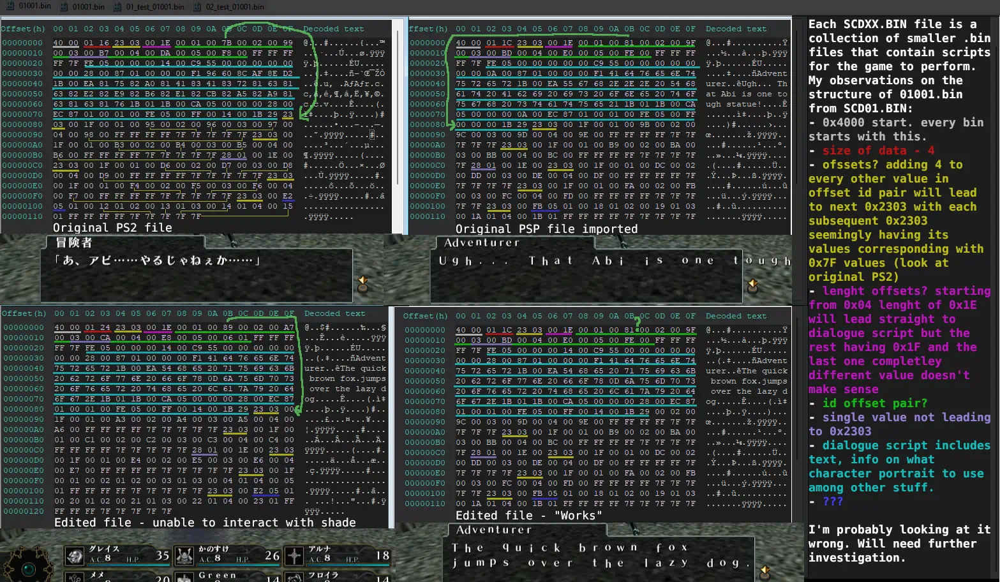

# Elminage-Yami-no-Miko-to-Kamigami-no-Yubiwa-PS2-English-Patch
Attempt at making an English translation patch for Playstation 2 version of "Elminage: Priestess of Darkness and the Ring of the Gods".

## What is possible right now:
* Reinsertion of edited graphics.
* Translation of text stored in .CSV files and an ELF file.
* Translation of text stored in SCD.BIN is limited by lenght of original string x 2 (1 byte per ascii vs 2 bytes per shift-jis).

Currently looking into SCDXX.BIN files. As I uploaded the breakdown below, I've noticed a mistake with the edited "not working" file... Offset to the single not 0x2303 value is wrong. Changing it to correct 0xC5 lets me interact with the shade.
### Update: 01/02/2026
While I wasn't completely incorrect about the file layout in my original assessment, on further inspection with debugger and ghidra, I got a better understanding of how the game reads these files and executes scripts within them. I would not be making a big write-up on this, unless there is any interest, because I'm not good at this, but specific things I want to point out with a PS2 file as an example, is value at 0xBB (2801001E00). This is the one that tells the game to go to 0x22 (0x1E + 4) and what I assumed to be one big "dialouge script" is actually a chain of smaller scripts executed one after another. For example, 0xFE05 tells the game to change the transparency of the "shade" that you interact with and takes two 2-byte values as parameters (target transparency level, speed at which it should change). 0xC955 tells the game to load character portrait on screen and takes four 2-byte values as parameters (portrait ID, x offset, y offset, appearence speed) if x or y is 0 then it's centered. 0x8701 hides players UI with one 2-byte value as parameter.

